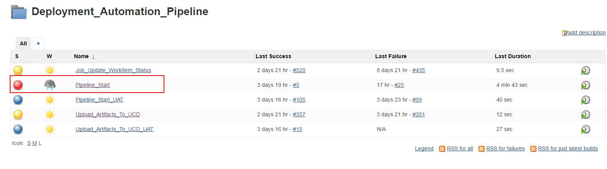
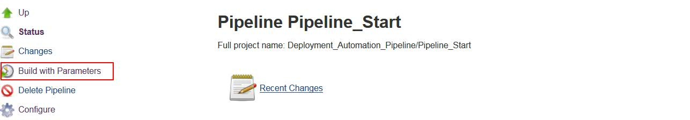
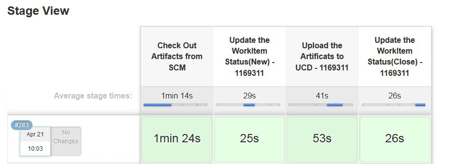

# Jenkins_Pipeline

Jenkins pipeline code for each stage
## files describe:
* pipeline.groovy: Main file - define the jenkins job flow
* jq_parse_component_process_json.ksh: Catch Log - Function: parse the Json file 
* floder resource: some cofigure and script about check code from RTC 

## **Configure:**
### 1. Jenkins
* **node**: master(windows) - 9.112.244.119; slave(windows) -  unknown; testing server(SUSE) - 9.111.111.148
* **Web location**: 9.112.244.119:8080
* **start Jobs**: Deployment_Automation_Pipeline/Pipeline_Start
* **master workspace**: C:/Users/Administrator/.jenkins/workspace/Deployment_Automation_Pipeline
### 2. Fetch Code form RTC
* **FetchFiles.jar location**: ${Deployment_Automation_Pipeline 's workspace} 
* **resource Floder location**: ${The location of the FetchFiles.jar} 
### 3. UCD
* **Application**:
* **Environment**:
* **Component**:
* **Process**:

### 4. Catch Detail Log From UCD(It'll be completed later~~~)

## **Usage Flow:**
### 1.Start the Job
* **step1**

* **step2**

* **step3**

### 2.Job Status

