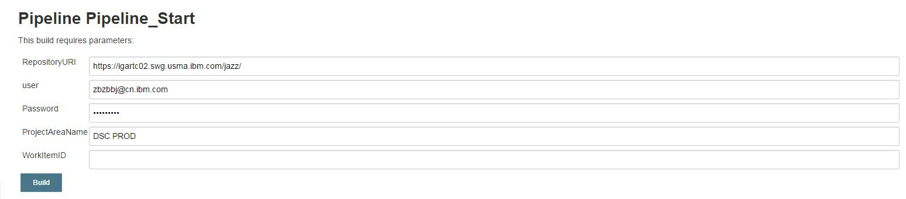

# Jenkins_Pipeline

## Flow

## Files Description
* **pipeline_stable.groovy**: Main file - define the jenkins job flow
* **Jenkisnfile**: define the jenkins job flow, used by SCM
* **jq_parse_component_process_json.ksh**: Catch Log - Function: parse the Json file 
* <floder> **resource**: some cofigure and script about check code from RTC 

## Resource Folder
* **attribute.txt**: map the category && environment in WI

* **loadfiles.bat**: check code from RTC by SCM tool

## Jar File
* **Function**: query && describe the WI's description
* **Location**: ${Pipeline's workspace}/FetchFiles.jar

## Version Folder

## Version Repo(UAT) 

## WI Description

## **Configure:**
### Jenkins
* **UCD server**:

* **params**:
* **RepositoryURI**: RTC
* **user**: login in RTC
* **Password**: for user
* **ProjectAreaName**: ex DSC PROD
* **WorkItemID**: ex 1169311

### Urbancode Deploy
* **Component Configure**:

* **Application**: ex, DSW_IM_DevOps_Applications(now)
* **Environment**: defined by WI
* **Component**: defined by WI
* **Process**: defined by WI

## **Usage**:
### Start the Job - FVT && UAT
* **step1**

* **step2**

* **step3**

### UAT

